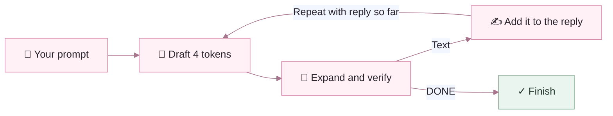

<h1 align="center">JevGPT</h1>

<p align="center">
  
  <a href="https://docs.typesafe.ai"></a>
  
</p>

<p align="center"><strong>A classifier pretending to be a chatbot.</strong></p>

<p align="center">
  
</p>

A deliberately questionable chatbot: Jev chooses one OpenAI tokenizer fragment at a time, and the growing answer becomes the next classification input. No generative model proposes the output.

## Run

Requires Python 3.11+ and [uv](https://docs.astral.sh/uv/).

```sh
uv sync
# Only if you do not already have a .env file:
cp -n .env.template .env
# Add your TypeSafe key to .env, then:
uv run jevgpt "Say hello in one short sentence."
uv run jevgpt
```

Interactive mode supports `/reset` and `/quit`. Output streams as tokens arrive. By default, the CLI shows only the conversation. Add `--trace` to show routing diagnostics and a final summary of stopping reason, generated tokens, HTTP calls, reported input-token usage, and elapsed time. The key stays server-side in this local process; `.env` is ignored by Git.

```sh
uv run jevgpt "Why is the sky blue?" --max-tokens 64
uv run jevgpt "Why is the sky blue?" --selection shortlist
uv run jevgpt "Hello" --dry-run             # No Jev calls or API key needed
uv run jevgpt --corpus ./my-conversations.txt --seed 42
uv run pytest
```

The first run downloads the `cl100k_base` tokenizer data. `--dry-run` may therefore need network access on its first use. No OpenAI API key is needed.

## Algorithm



Jev drafts up to four tokens using the original heuristic shortlist, then batch-checks them against additional vocabulary candidates. It emits the matching prefix and the verifier's correction at the first disagreement, then repeats until DONE or a limit. Unverified drafts never appear in the chat.

### Selection modes

| Mode | How it works | Cost per step |
| --- | --- | --- |
| **Speculative (default)** | Draft 4 shortlist tokens, rank 128 novel candidates per position, then verify against baseline finalists. | Usually 6 calls per fully accepted 4-token block |
| **Tournament** | Evaluate all 390 buckets, compare their winners in semifinals, then choose a finalist or `DONE`. | Many batched calls; 44 per step in one live test |
| **Hierarchical** | Search vocabulary groups, keep three promising branches, then compare up to 48 tokens plus `DONE`. | Usually 4 HTTP calls |
| **Shortlist** | Choose from 254 tokens drawn from common text, the prompt, and likely continuations, plus `DONE`. | 1 HTTP call |

All modes use the prompt and full reply so far. Speculative mode uses up to four concurrent requests, with verification questions normally fitting into one request per stage. Use `--selection shortlist` for the original one-call-per-token baseline. `--selection hierarchical` and `--selection tournament` remain available for experiments; tournament still launches all batches concurrently by default. Normal output stays a plain chatbot. `--trace` enables diagnostics. Retries and payload splitting can add calls.

### Tradeoffs

- **Speculation is heuristic:** the draft and verifier are both Jev; the verifier sees extra candidates, not superior model weights. Rejected drafts waste work, so this can be slower than plain shortlist. It is not distribution-preserving speculative sampling.
- **Coverage vs. speed:** tournament evaluates every eligible token at every step and is expensive. Hierarchy prunes branches, and shortlist is fastest but restricts candidates.
- **Search isn't certainty:** all approaches can discard a good continuation. Reported probabilities apply only to the choices shown, not the whole vocabulary.
- **Text has limits:** partial UTF-8 tokens are excluded, reducing multilingual coverage. Long conversations drop older turns; the current reply is retained.
- **Quality is experimental:** wider search hasn't demonstrated reliable improvement. One sky-blue answer was `Because the Air air air blocks blue`—still wrong and repetitive.

Generation stops on `DONE`, the output cap (128 tokens by default), or repeated loops. Local request-size guards keep payloads bounded but aren't exact Jev token counts.

[Four-token speculation and benchmark](docs/speculative.md) · [Tournament details and benchmark](docs/tournament.md) · [Other algorithms and live comparisons](docs/algorithm.md) · [TypeSafe API](https://docs.typesafe.ai/api) · [Model limits](https://docs.typesafe.ai/models)
